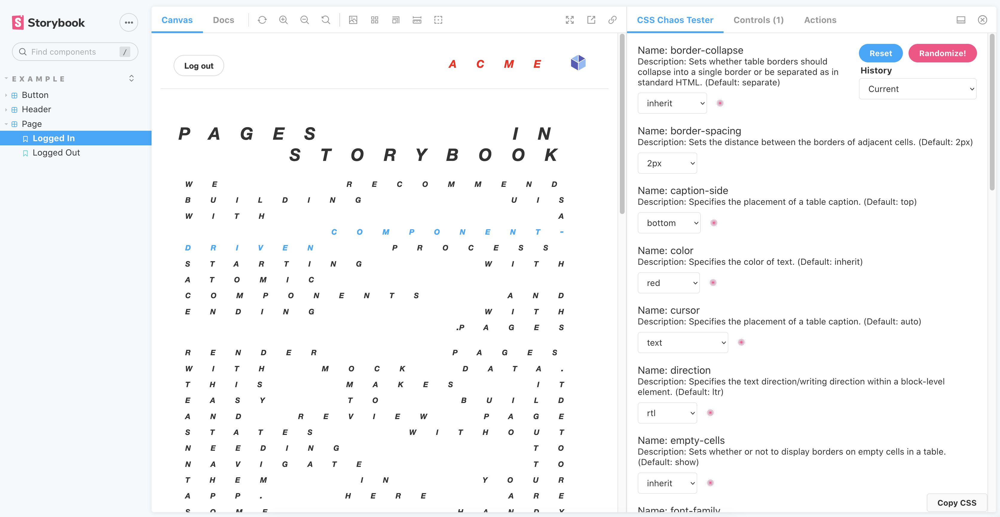

# Storybook CSS Chaos Addon

An addon that applies inheritable css properties around a component to better test in-context scenarios that alter the look and feel of a component. By testing in this way, you can limit style bleeding when the component is added in an application.

### Before


### After


## Usage scripts

Run `npm install css-chaos-addon`

In your main.js file, add to the addons array:
```
addons: ["css-chaos-addon"]
```

## Customizing CSS Properties

To customize, you will need to leverage Storybook's parameters feature that can be set globally or at the story level. The parameter used for the CSS Chaos Addon is called `cssPropertyData`.

If you want to add a css property:
```
 parameters: {
    cssPropertyData: [
      {
        "name": "hello world",
        "description": "Lorem ipsum",
        "default": "world",
        "values": [
          "hello",
          "world"
        ]
      },
    ]
    ,
  }
```

If you want to alter a css property, update one or all keys in the object (name, description, default, values):
```
 parameters: {
    cssPropertyData: [
      {
        "name": "updated-name",
        "description": "An updated description goes here",
        "default": "new default",
        "values": [
          "this",
          "includes",
          "updated",
          "values",
          "new default"
        ]
      },
    ]
    ,
  }
```

To remove an existing css property dropdown from the addon panel, remove all of the values from the object:
```
 parameters: {
    cssPropertyData: [
      {
        "name": "color",
        "values": []
      },
    ]
    ,
  }
```

## Development scripts

- `npm start` runs babel in watch mode and starts Storybook
- `npm run build` build and package your addon code