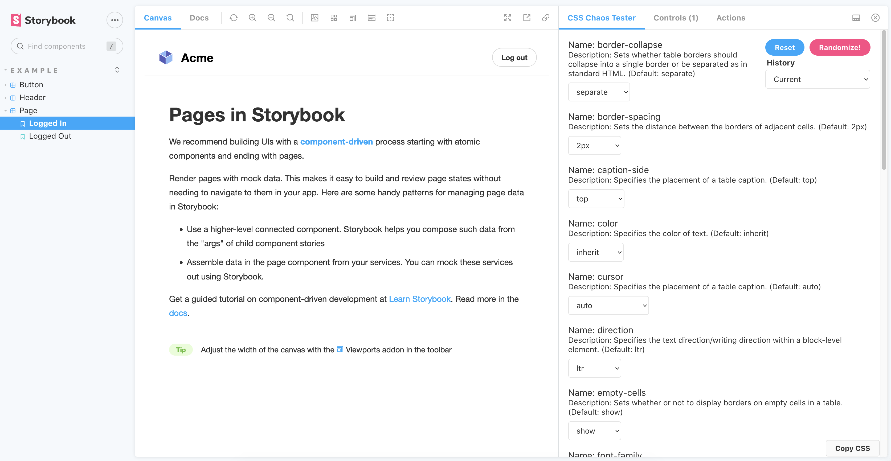

# Storybook CSS Chaos Addon


An addon that applies inheritable css properties around a component to better test in-context scenarios that alter the look and feel of a component. By testing in this way, you can limit style bleeding when the component is added in an application.

### Before


### After


## Usage scripts

Run `npm install css-chaos-addon`

In your main.js file, add to the addons array:
```
addons: ["css-chaos-addon"]
```

## Development scripts

- `npm start` runs babel in watch mode and starts Storybook
- `npm run build` build and package your addon code

